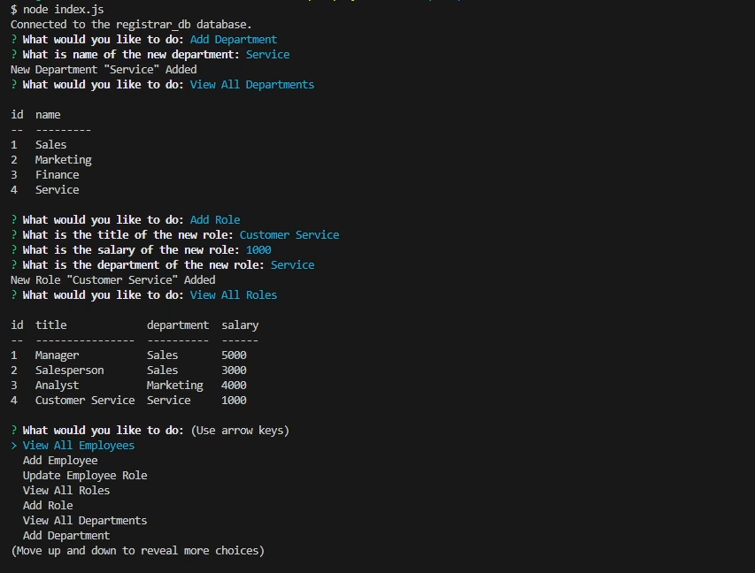

# employee-tracker

## Description

A CLI based program as a simple employee management program using MySQL that lets you view / add employees, roles, and departments to keep track of.

## Installation

Before downloading the repo, make sure you have node.js installed. After that, install the repo and use the command line to reach the downloaded repo's directory. Run 'npm install', then run `node index.js`.

## Usage

After running starting the program with `node index.js`, follow the prompts on the command line.

## License
N/A